# How to play SWOQ

A SWOQ game is hosted by the server. Your program that plays the game should use the `GameService` *gRPC* service to communicate with the server. It provides only two functions `Start` and `Act`.

## `Start`

With this function your program can start a new game. There are two types of games: a quest and a training. See [Quest queueing](#quest-queueing) for more information. The function has two parameters:

    string userId = 1;
    optional int32 level = 2;

Your unique `userId` is given during registration.

The `level` parameter is optional. If you don't provide it, then a Quest game will be started. If you do provide it, then a Training game will be started. The `level` parameter must be a number greater than or equal to 0, and less than or equal to your user level. Your user account (identified with `userId`) has a certain level. Your program can only start Training games up to the level you have achieved.

The first parameter of the server's response is a result value:

    StartResult result = 1;

If this value is `START_RESULT_OK` then the game is started and more parameters are provided. For all other values it means the game was not started. See [StartResult](#startresult) for more information. If the game is started successfully, the following parameters are provided:

    optional string gameId = 2;
    optional int32 width = 3;
    optional int32 height = 4;
    optional int32 visibilityRange = 5;
    optional State state = 6;

`gameId` is a unique identifier for this game. It has to be provided with any follow-up action, so the server knows which game your program wants to control. *Note*: this makes it possible to run multiple Training games in parallel from the same connection.

The `width` and `height` parameters denote the size of the map and `visibilityRange` defines how far your player can see on that map (see [PlayerState](#playerstate).)

Finally the last, and maybe most import parameter is `state`. This structure contains the current state of the game, like where your player is currently located, and what it can currently see. For more information see [State](#state).

### StartResult

| StartResult                             |                                                                                                                                                                                                                                                                    |
| --------------------------------------- | ------------------------------------------------------------------------------------------------------------------------------------------------------------------------------------------------------------------------------------------------------------------ |
| `START_RESULT_OK = 0`                   | A game was started successfully.                                                                                                                                                                                                                                   |
| `START_RESULT_INTERNAL_ERROR = 1`       | Something unexpected went wrong on the server. Contact the administrators if it persists.                                                                                                                                                                          |
| `START_RESULT_UNKNOWN_USER = 2`         | The `userId` provided does not identify an existing user. Use the id that was given to you during registration. **Note**: This is NOT your user name.                                                                                                              |
| `START_RESULT_INVALID_LEVEL = 3`        | The level specified is not a valid value for the given user. It could be out-of-range, or the user specified with `userId` does not have a sufficiently high enough level. Check the level of your user account on the portal or in the high-score list of the dashboard. |
| `START_RESULT_QUEST_QUEUED = 4`         | Another Quest game is already active, so your request to start a Quest game was queued by the server. See [Quest queueing](#quest-queueing)                                                                                                                                            |
| `START_RESULT_QUEST_ALREADY_ACTIVE = 5` | You tried to start another Quest game while a previously started Quest game is still active. You are only allowed to have one Quest active. If the other game is inactive, then it will be automatically cleaned up by the server and you can start another quest. |

### Quest queueing

If you start a Quest game and there is already another Quest game active, your start request will be queued. You have to keep your spot in the queue active by periodically sending another Quest start request. Do not do this too quick, but also not too slow. Somewhere between every 1 second and every 5 seconds. 

As soon as it is your turn your start request will return `RESULT_OK` instead. If you don't retry within 10 seconds your spot will be given to the next user in the queue.

## `Act`

The second function the `GameService` provides is `Act`, which allows controlling the player in the game that was started with the `Start` function. It only needs the following two parameters:

    string gameId = 1;
    optional DirectedAction action = 2;

The `gameId` parameter should contain the unique id that was given by the server in response to the `Start` function.

The second parameter, `action`, denotes the action the player should take (see [DirectedAction](#directedaction)). When `NONE` is given the player won't move, but the game will continue to play a tick. This could be handy in some situations. The other four values define the direction the player should move. The map should be oriented such that the top left corner is position (0, 0), with y increasing when moving down (i.e. south) and x increasing when moving right (i.e. east).

The server will perform the action in the game and respond whether this succeeded. The response has only two parameters.

    ActResult result = 1;
    optional State state = 2;

The `result` parameter indicates whether or not the action was performed. When it is the value `ACT_RESULT_OK` the action was performance and the next parameter, `state`, contains the updated game state. For all other values of `result` it indicates the reason why the action was not performed. See [ActResult](#actresult) for more information.

### DirectedAction

| DirectedAction                   |                                                        |
| -------------------------------- | ------------------------------------------------------ |
| `DIRECTED_ACTION_NONE = 0`       | Do not move the player, but proceed the game one tick. |
| `DIRECTED_ACTION_MOVE_NORTH = 1` | Move the player north (-Y)                             |
| `DIRECTED_ACTION_MOVE_EAST = 2`  | Move the player east (+X)                              |
| `DIRECTED_ACTION_MOVE_SOUTH = 3` | Move the player south (+Y)                             |
| `DIRECTED_ACTION_MOVE_WEST = 4`  | Move the player west (-X)                              |

### ActResult

The following result values describe how the server processed your `Act` request.

| ActResult                         |                                                                                                                                                                                                                                                                                       |
| --------------------------------- | ------------------------------------------------------------------------------------------------------------------------------------------------------------------------------------------------------------------------------------------------------------------------------------- |
| `ACT_RESULT_OK = 0`               | The action was processed successfully by the server.                                                                                                                                                                                                                                  |
| `ACT_RESULT_INTERNAL_ERROR = 1`   | Something unexpected went wrong on the server. Contact the administrators if it persists.                                                                                                                                                                                             |
| `ACT_RESULT_UNKNOWN_GAME_ID = 2`  | The provided `gameId` does not identify an active game. If it was active before, then you probably waited too long with performing an action. The server automatically cleans up inactive games. So you cannot recycle old games. If you wait too long, you have to start a new game. |
| `ACT_RESULT_MOVE_NOT_ALLOWED = 3` | The movement your action described is not allowed. For example, because the position you want to move your player to is a wall.                                                                                                                                                   |
| `ACT_RESULT_UNKNOWN_ACTION = 4`   | The action value you provided is not a valid action. Your code is sending a wrong request.                                                                                                                                                                                            |
| `ACT_RESULT_GAME_FINISHED = 5`    | You tried to perform an action on a game that is already finished. This could be because it was successfully exited, but could also be the result of a time out. Check [GameStatus](#gamestatus) for more information why the game was finished.                                                     |

## State

The server will respond to each action with an updated game state. This state contains the following items.

    int32 tick = 1;
    int32 level = 2;
    GameStatus status = 3;
    optional PlayerState playerState = 4;

The `tick` field denotes how many game ticks have been executed. **Tip**: If you create your own log file, then log the tick at each line, then you can quickly relate each log line with the steps in the replay that was recorded.

The `level` field indicates which level your program is currently playing. For Training games this is always the same as the requested level, but for Quest games this number will increase every time your program finishes a level.

As long as a game is active the `status` field is set to `GAME_STATUS_ACTIVE`. When it is equal to any other value (see [GameStatus](#gamestatus)), the game has finished and the server will no longer process future actions. Any successive call to `Act` will result in `ACT_RESULT_GAME_FINISHED`. Eventually the finished game will be cleaned up by the server.

Finally, the `playerState` field contains the information about the player.

### PlayerState

This structure contains the information about the player. It contains the following fields:

    Position position = 1;
    repeated Tile surroundings = 2;

The `position` field is a structure with an integer `x` and `y` field that indicates the map position that is currently occupied by the player.

The `surroundings` field is an array of `Tile` values (see [Tiles](#tiles)). It describes the type of each position on the map that are visible by the player. Its a flattened version of a two-dimensional grid around the player. The width and height of this grid is defined by the `visibilityRange` field given in the Start response, and are equal to `1 + 2 * visiblityRange`. The player is always in the middle of this 2D grid. It is stored in row-major order. So the first entries are all for the first row, then the second row, etc. It can be visualized as depicted below (from the ReplayViewer).

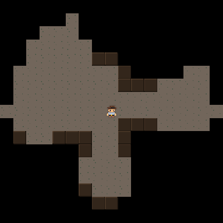

### Tiles

The map is a grid of tiles. Each tile is of a specific type and below is the list of the different types.

| Tiles                           |                                                                    |                                                                                 |
| ------------------------------- | ------------------------------------------------------------------ | ------------------------------------------------------------------------------- |
| `TILE_UNKNOWN = 0`              |                            | This position has not been visited before, so the type of this tile is unknown. |
| `TILE_EMPTY = 1`                | 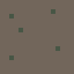                               | This location is empty and can be walked upon.                                  |
| `TILE_PLAYER = 2`               | 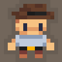                             | This tile is occupied by the player.                                            |
| `TILE_WALL = 3`                 |                                  | This tile is a wall. It blocks the movement of the player.                      |
| `TILE_EXIT = 4`                 | 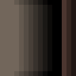                                 | This tile is the exit where the player needs to move on to finish the level.    |

### GameStatus

This value describes the status of the game. Whether or not it is finished, but also why it is finished.

| GameStatus                             |                                                                                                      |
| -------------------------------------- | ---------------------------------------------------------------------------------------------------- |
| `GAME_STATUS_ACTIVE = 0`               | The game is still active and `Act` can be called again.                                              |
| `GAME_STATUS_FINISHED_SUCCESS = 1`     | The game is finished successfully.                                                                   |
| `GAME_STATUS_FINISHED_TIMEOUT = 2`     | The time since the last action was too long ago and the game has been terminated by the server.      |
| `GAME_STATUS_FINISHED_NO_PROGRESS = 3` | The server did not detect any notable changes while playing for a long time and terminated the game. |
| `GAME_STATUS_FINISHED_PLAYER_DIED = 4` | The last action resulted in the player's death, causing the game to end.                             |

# Level 2 and higher

Surprise! A new feature is introduced in level 2. There are now doors and keys on the map. You can pickup a key by moving your player over it. It will be placed in its inventory. You cannot drop a key, once picked it will remain in the inventory indefinitely. Doors can be opened by placing your player on an adjacent tile and using the new `Use` actions that have been added as well.

In order to use this new feature, a few things have been added to the proto file. Make sure you copy the latest version and update your code accordingly. The following changes were made.

### DirectedAction

The `DirectedAction` enum was extended with the some new actions. With these actions you can use an item in your player's inventory on one of the four directions around it.

| DirectedAction                  |                                                                     |
| ------------------------------- | ------------------------------------------------------------------- |
| `DIRECTED_ACTION_USE_NORTH = 5` | Use the item in the inventory on the tile north (-Y) of the player. |
| `DIRECTED_ACTION_USE_EAST = 6`  | Use the item in the inventory on the tile east (+X) of the player.  |
| `DIRECTED_ACTION_USE_SOUTH = 7` | Use the item in the inventory on the tile south (+Y) of the player. |
| `DIRECTED_ACTION_USE_WEST = 8`  | Use the item in the inventory on the tile west (-X) of the player.  |

 Note that it is not possible to move and use in the same tick, since these are additional values of the same enum.

### ActResult

Due to the addition of some extra actions the `ActResult` enum was extended as well. The following new results could now be returned by the server in response to your actions.

| ActResult                        |                                                                                                                                                             |
| -------------------------------- | ----------------------------------------------------------------------------------------------------------------------------------------------------------- |
| `ACT_RESULT_USE_NOT_ALLOWED = 6` | You cannot use the item in the inventory of the player on this map position.                                                                                |
| `ACT_RESULT_INVENTORY_FULL = 7`  | You cannot move to this map position, because that would result in a pickup of an item but the inventory of the player is already filled with another item. |
| `ACT_RESULT_INVENTORY_EMPTY = 8` | A use action on this map position is not allowed because your player has nothing in its inventory.                                                          |

### Inventory

A new field was added to the `State` structure to describe the content of the inventory of your player.

    optional Inventory inventory = 3;

This field describes what item (only one, not multiple) is in its inventory. It can be any of the following values.

| Inventory                 |                                            |
| ------------------------- | ------------------------------------------ |
| `INVENTORY_NONE = 0`      | Nothing. The inventory is empty.           |
| `INVENTORY_KEY_RED = 1`   | A red key is in your player's inventory.   |
| `INVENTORY_KEY_GREEN = 2` | A green key is in your player's inventory. |
| `INVENTORY_KEY_BLUE = 3`  | A blue key is in your player's inventory.  |

### Tiles

The following tiles have been added to denote the position of doors and keys on the map.

| Tiles                 |                                                |                                                    |
| --------------------- | ---------------------------------------------- | -------------------------------------------------- |
| `TILE_DOOR_RED = 5`   | 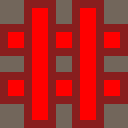     | A red door that can be opened by a red key.        |
| `TILE_KEY_RED = 6`    | 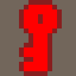       | A red key that can be used to open a red door.     |
| `TILE_DOOR_GREEN = 7` | 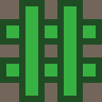 | A green door that can be opened by a green key.    |
| `TILE_KEY_GREEN = 8`  | 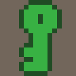   | A green key that can be used to open a green door. |
| `TILE_DOOR_BLUE = 9`  |    | A blue door that can be opened by a blue key.      |
| `TILE_KEY_BLUE = 10`  | 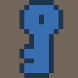     | A blue key that can be used to open a blue door.   |

# Level 6 and higher

Another feature was added to the game. From now on, boulders can be present on the map. These large rocks can be picked up by the player. They will occupy the inventory slot, so nothing else can be picked up as long as a boulder is in the inventory.

Unlike keys, you cannot pick it up by moving your player over it. In fact, you cannot move through it, it blocks your player's path. Your player has to stand on an adjacent tile with an empty inventory, and then you can send a `Use` action to pick it up. It will then occupy the only slot in your player's inventory. Also unlike keys, a boulder can be dropped by the player. With a boulder in the inventory you can perform a `Use` action on an empty tile to drop the boulder there. Be aware, a boulder is heavy, you should not keep it in your inventory forever.

### Tiles

The following tile was added to denote the position of a boulder on the map.

| Tiles               |                                          |                                                                                          |
| ------------------- | ---------------------------------------- | ---------------------------------------------------------------------------------------- |
| `TILE_BOULDER = 11` | 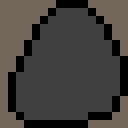 | This is a boulder that blocks your player's path, but can be picked up and dropped by the player. |

### Inventory

The `Inventory` enum was extended to also describe the state when a boulder is in the inventory of the player.

| Inventory               |                                       |
| ----------------------- | ------------------------------------- |
| `INVENTORY_BOULDER = 4` | A boulder is your player's inventory. |

# Level 7 and higher

Pressure plates have been introduced. These special tiles allow opening of doors by standing on them instead of using a key. The plates have a color that indicates which door is opened by that plate. **Note**: All door tiles on the map of that color will be opened.

When your player steps on a plate all doors are opened, when it moves off a plate the door closes again.

For this feature only the following tile definitions have been added.

| Tiles                            |                                                                    |                                                   |
| -------------------------------- | ------------------------------------------------------------------ | ------------------------------------------------- |
| `TILE_PRESSURE_PLATE_RED = 12`   | 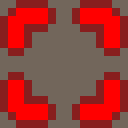     | A red pressure plate that can open red doors.     |
| `TILE_PRESSURE_PLATE_GREEN = 13` | 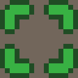 | A green pressure plate that can open green doors. |
| `TILE_PRESSURE_PLATE_BLUE = 14`  | 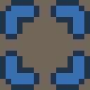   | A blue pressure plate that can open blue doors.   |

# Level 8 and higher

What's that? Another living being in this map? Yes, this level introduces an enemy. This is a non-playable character that will try to kill your player by attacking it with a sword. 

If your player is on an adjacent tile at the start of a tick, then the enemy will attack your player and deal 1 point of damage. If your player is out of health, then it will die. The enemy can move and will chase your player. So, be sure to stay away.

### Tiles

The following tile has been added to denote the position of the enemy.

| Tiles             |                                      |                                                                     |
| ----------------- | ------------------------------------ | ------------------------------------------------------------------- |
| `TILE_ENEMY = 15` | 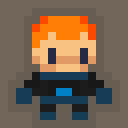 | This is the enemy. It will try to kill your player by attacking it. |

### PlayerState

Every attack your player's health will be reduced, so now the `PlayerState` structure will also contain a field that denotes that health.

    optional int32 health = 4;

When it reaches 0, your player will die.

### ActResult

Since your player has no sword (yet), then you cannot attack back. So if you try to `Use` on an enemy you will get the following result:

| ActResult                 |                                                                              |
| ------------------------- | ---------------------------------------------------------------------------- |
| `ACT_RESULT_NO_SWORD = 9` | You cannot use on this position, because your player doesn't posses a sword. |

# Level 10 and higher

Finally, you can fight back. This level contains a sword and extra health.

A sword can be picked up by moving your player over it (like keys). It will not end up in its inventory, but it is equipped automatically, leaving the inventory slot available for keys or boulders. You can only pickup one sword. If you try to move over a second sword your move will not be allowed with the `ACT_RESULT_INVENTORY_FULL` result. If your player has a sword in its possession, then you can send a `Use` action for an enemy on an adjacent tile to attack. The attack will deal 1 damage to the enemy.

Health can be picked up indefinitely. Every time your player moves over a health tile, the health is added to the player's health (and the health tile is removed from the map).

### Tiles

The following two tile types have been added to denote position of swords and health on the map.

| Tiles              |                                        |                                                                                                                                                     |
| ------------------ | -------------------------------------- | --------------------------------------------------------------------------------------------------------------------------------------------------- |
| `TILE_SWORD = 16`  | 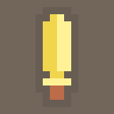   | A sword that can be used to attack enemies. Your player can move over it when it hasn't got a sword equipped and it will be picked up and equipped. |
| `TILE_HEALTH = 17` | 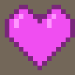 | When your player moves on this tile it will gain 3 more health points. Extending its life a little bit.                                             |

### PlayerState

The following field has been added to the `PlayerState` structure to show whether or not your player has a sword equipped.

    optional bool hasSword = 5;

# Level 12 and higher

Ooh dear, another player has appeared! You can now play with two players at the same time. That demands some serious coordination.

In order to finish a level both your players need to go through the exit. If one of the two players die it is game over.

### ActionRequest

In order to control the second player a field has been added to the `ActionRequest` structure to denote the action the second player needs to take.

    optional DirectedAction action2 = 3;

It works the same as the first player. The server will first process the action of the first player, and then the action of the second player.

### State

An extra `PlayerState` has been added to describe the state of the second player.

    optional PlayerState player2State = 5;

It contains all the same information as the state of the first player. Including its own surroundings. So the one player can appear in the surroundings of the other player.

### ActResult

Now that there are two players, it will happen that one of the players already went through the exit before the other one. For players that have already exited no action is allowed (except for `NONE`). If you do try this your `Act` call will fail with one of the following new results:

| ActResult                             |                                                                                   |
| ------------------------------------- | --------------------------------------------------------------------------------- |
| `ACT_RESULT_PLAYER_NOT_PRESENT = 10`  | The action cannot be performed because player #1 is no longer present on the map. |
| `ACT_RESULT_PLAYER2_NOT_PRESENT = 11` | The action cannot be performed because player #2 is no longer present on the map. |

### GameResult

When player #2 dies, the game is finished and you will get the following `GameResult` value in your `State`.

| GameStatus                              |                                                                              |
| --------------------------------------- | ---------------------------------------------------------------------------- |
| `GAME_STATUS_FINISHED_PLAYER2_DIED = 5` | The last action resulted in the death of player #2, causing the game to end. |

# Level 22 and higher

You have reached the end of this Quest. The final level has one large obstacle to overcome: an end boss. This is a tough guy. Good luck defeating this master wizard.

Only two tiles have been added in this level to denote the position of the boss.

| Tiles                |                                            |                                                                                                     |
| -------------------- | ------------------------------------------ | --------------------------------------------------------------------------------------------------- |
| `TILE_BOSS = 18`     | 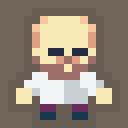         | The end boss of the quest. You need to defeat this ultimate enemy in order to exit the final level. |
| `TILE_TREASURE = 19` | 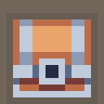 | A treasure chest with loads of gold and diamonds. The ultimate prize you want to possess.           |

And the treasure can end up in your inventory:

| Inventory                |                                              |
| ------------------------ | -------------------------------------------- |
| `INVENTORY_TREASURE = 5` | The treasure chest is now in your inventory. |

